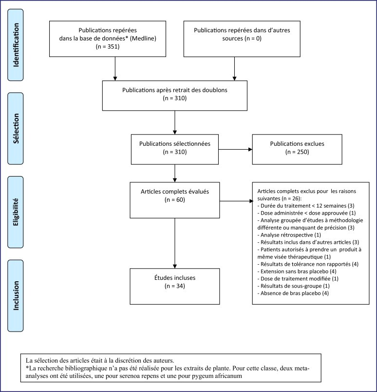

# Meta-Analyses


Références :

- @brun_analyse_2018 

- @cooper_handbook_2009

- @sauvant_les_2005

- @sauvant_meta-analyses_2008

Données disponibles ici : http://www.imbi.uni-freiburg.de/lehre/lehrbuecher/meta-analysis-with-r/datasets


## Pourquoi une meta-analyse ?


En sciences animales, cas des 3R => Permet de raffiner les données et éviter de refaire des essais. Permet d'avoir une vision d'ensemble sur des essais menés dans des conditions différentes. 

Un essai = un cas particulier => Impossible de généraliser tout à partir d'un cas particulier (notion d'anecdote). Sont souvent de petite taille et en conditions très contrôlées. 


- Avoir vue d'ensemble sur efficacité d'un produit

- Estimer des lois de dose-réponse

- Valoriser des résultats souvent estimés "secondaires"


### Meta-Analyses qualitative ou quantitative ?


Quali = Synthèse bibliographique; Peut pas contre être biaisée, car pas de mesure non ibjective. Pbm aussi sur prise en compte des différnces inter études (conditions, résultat stat très fort ou faible). Esprit humain a du mal à apprécier les grands nombres. 


### Déroulement d'une méta-analyse


Il existe des grandes étapes communes à toutes les méta-analyses :

- Définition de l'objectif de la méta-analyse : définition de la taille d'effet, variable de réponse, variables explicatives et population
- Revue systématique : définition du protocole de recherche bibliographique, récupération des études
- Sélection des études et extraction des données : définition de critères de sélection application des critères aux études, extraction des données des études sélectionnées
- représentation graphique : permet de détecter erreur de rentrée, données aberrante, bon codage des données
- Analyse statistique : définition d'un ou plusieurs modèles statistiques, estimation des paramètres, estimation des quantités d'intérêt, analyse d'incertitude
- analyse critique : analyse de sensibilité, analyse du biais de publication
- Communication des résultats

Pour cela, on peut résumer les étapes à l'aide d'un diagramme de prisma



### Forces et Faibles d'une méta-analyse
**Forces :**

- Permet de résumer les résultats de plusieurs études scientifiques, en évitant les biais liés à une interprétation qualitative
- Répétables : les résultats d'une méta-analyse vont pouvoir se généraliser à l'ensemble des études du domaine concerné
- Consolidation de résultats : Quand des études se contredisent, la méta-analyse permet d'avoir un point de vue plus global. 
- Biais de Publications : une méta-analyse permet d'estimer le biais de publications de certaines études analysées

**Faiblesses :**

- Dépendant des données initiales : Si les étudies recueillies sont de mauvaises qualité, la méta-analyse le sera également (*Garbage in, garbage out*)
- Sélection des études : Un des reproches principaux de la méta-analyse est d'agglomérer des études qui n'ont pas forcément de lien entre elles, sans tenir compte de leur différences. 


## Construction d'un méta-dispositif 


But est de rassembler les données qui se ressemblent, mais en tenant compte des écarts via l'effet essai. 

But est qu'intra-essai, on compare les mêms choses => Plusieurs choses qui peuvent être comparés, plusieurs méta dispositifs possibles pour les sous questions qu'on se pose. 

Important pour paradoxe de simpson

Nécessite du coup un codage par question => Etape très importante

Filtrage des données => là où peut se poser la majeure des différences . Exemple sur des données à inclure ou pas selon @mathur_finding_2019. Test de violence qd joue aux jeux vidéos => Ajout ou de nom de sauce piquante dans le plat d'une personne. 


## Estimation d'une taille d'effet moyenne

Peut étudier des variables quali/quanti, que ce soit en explicatif ou à expliquer.

Le plus important reste le facteur étude (fixe ou aléatoire ?)


## Cas qualitatif

Il s'agit du type de méta-analyse le plus répandu. Pour cela, on définit les éléments suivants :

- la variable d'intérêt X, qui peut être continue, discrète, qualitative, etc..
- le contrôle C
- le traitement expérimental E
- la population d'étude
- la taille d'effet permettant de comparer C et E


L'effet du traitement E est étudiée en définissant une quantité appelée "taille d'effet" , qui compare les valeurs obtenues pour le traitement E ($X_E$) et pour le contrôle. La taille d'effet peuvent être définies, comme la la différence entre $X_E$ et $X_C$ ou leur ratio $\frac{X_E}{X_C}$. Un des avantages du ratio est d'utiliser des données exprimées dans des unités différentes. 

### Définition de plusieurs tailles d'effet 

#### Correction des biais liés à l'utilisation des ratios

Les logs de ratio peuvent être fréquemment utilisés. Cependant, lors de petits effectifs, ces estimateurs risquent d'être biaisés du fait du manque de données.  Pour cela, on peut utiliser les tailles d'effets définies par Lajeunesse en 2015.


Dans ce cas, 

- La taille d'effet vaut = $L_B=ln(\frac{\overline{X}_E}{\overline{X}_T}) + \frac{1}{2}(\frac{(\sigma_E^2)}{n_E\overline{X}_E^2} - \frac{(\sigma_C^2)}{n_C\overline{X}_C^2})$
- Sa variance V(ES) est définie par  $\sigma^2_{L_b} = \sigma^2_L+\frac{1}{2}[\frac{(\sigma_E^4)}{n_E^2\overline{X}_E^4} + \frac{(\sigma_C^4)}{n_C^2\overline{X}_C^4}]$

cependant, l'interprétation est beaucoup moins naturel. Une valeur de $L_b$ supérieure à 1 n'indique pas nécessairement que la moyenne des observations du traitement E est supérieure à celle du contrôle C. Si on compare les logs ratios basés sur un même contrôle C. Ils ne peuvent donc pas être interprétés facilement, et il est nécessaire de tenir compte de la corrélation entre ces deux logs ratios (Lajeunesse 2016)

#### Différences entre moyennes d'observations

Pour cela, on utilise le $d$ de Cohen, défini par $d=\frac{X_1-X_2}{\sigma _{pooled}}$ avec $\sigma_{pooled}=\sqrt{\frac{(n_1-1)\sigma_1^2+(n_2-1)\sigma_2^2}{n_1+n_2-2}}$. On peut alors estimer que $\sigma_d = \frac{n_E+n_C}{n_E*n_C} + \frac{d^2}{2(n_E+n_C)}$.

Cependant, $d$ est biaisé, notamment dans le cas de petit effectif (surestimation). On peut alors appliquer un facteur correctif à d, ce qui donne $g = Jd$ avec $J=1-\frac{3}{4(n_e+n_C-2)-1}$. On obtient alors l'écart type de $g$ par $\sigma_g=J\sigma_d$. Son interprétation reste cependant délicate.


#### Cas de données binaires

C'est globalement le cas de données issues de tableau de contingences. 

\begin{table}[!h]
  \centering
  \begin{tabular}{l|cc}
  & Réussite à l'examen & Échec à l'examen \\
  \hline
  Révision & 450 (A) &50 (B) \\
  Pas de révision & 350 (C) & 150 (D) \\
  \end{tabular}
  \caption{Tableau de contingence sur la réussite à un examen}
\end{table}.

avec $n_C = C+D$ et $n_E=A+B$. On définit la taille d'effet comme la différence de proportion $DP$, défini par $DP = P_E-P_C=\frac{B}{n_E}-\frac{D}{n_C}$, dont l'écart type $\sigma_{DP}=\sqrt{\frac{P_E(1-P_E)}{n_E}+\frac{P_C(1-P_C)}{n_C}}$


## Cas de comparaison de l'effet de deux traitements sur une variable continue.

Pour cela, on peut utiliser les packages **grid**, **rmeta** et **meta**. Ce cas est issu d'un \href{http://www.tqmp.org/RegularArticles/vol11-1/p037/p037.pdf}{\textcolor{blue}{document en ligne}}


```{r, message=F}
library(grid)
library(meta)
library(rmeta)
library(MAd)
data(dat.sim.raw, dat.sim.es)
```

Description du jeux de données *dat.sim.raw*, données fictives psychologiques 

- id : Numéro de l'étude
- nT : Nombre d'individu dans le traitement
- nC : Nombre d'individu dans le contrôle
- m1T (m2T) : Moyenne du groupe Traitement pour la variable 1 (2)
- m2C (m2C) : Moyenne du groupe Contrôle pour la variable 1 (2)
- sd1T sd(1T) : Ecart-type du groupe Traitement pour la variable 1 (2)
- sd1C (sd2C) :Ecart-type du groupe Contrôle pour la variable 1 (2)
- dose : Nombre de sessions de thérapies (variable continue)
- stress : Niveau moyen de stress dans l'échantillon (variable catégorielle)


Pour comparer les différences entre études, on va utiliser une taille d'effet permettant de comparer des moyennes. Dans ce cas de deux moyennes avec une seule variable explicative, on utilise le *d* de @cohen_statistical_1988. Dans ce cas, il se définit de la façon suivante :


\begin{center}
$d=\frac{X_1-X_2}{\sigma _{pooled}}$
\end{center}

où $X_1$ et $X_2$ sont sont les moyennes des deux groupes comparées sur la variable d'intérêt, et $\sigma_{pooled}$ est l'écart type poolé des deux groupes et estimé comme :

\begin{center}
$\sigma_{pooled}=\sqrt{\frac{(n_1-1)\sigma_1^2+(n_2-1)\sigma_2^2}{n_1+n_2-2}}$
\end{center}

avec $n_1$ et $n_2$ les nombres d'individus dans chaque groupe, et $\sigma_1$ et $\sigma_2$ les écart-types dans ces mêmes groupes. On peut en alors déduire la variance de $d$, défini tel que :

\begin{center}
$V(d)=\frac{2}{\tilde{n}}+\frac{d^2}{2(n_1+n_2)}$
\end{center}

où $\tilde{n}$ est la moyenne harmonique du nombre d'individu (de n1 et n2 donc)

Si l'effectif est de petite taille, le $d$ de Cohen risque de surévaluer la taille d'effet. 


## Réaliser une méta-analyse avec R

Pour cela, un package a été développé pour faciliter les méta-analyses sous R, le package *meta*. 


### Cas entre témoin et lot expérimental

#### Méthode de comparaison : SM ou MD ?

Pour débuter, on va prendre le cas simple, à savoir comparer un traitement expérimental à un lot contrôle (ou placebo). On cherche donc à savoir si le traitement à un effet positif par rapport au témoin. On va donc étudier la différence. Pour l'étude $k$, elle se définit par :
\begin{center}
$\hat\mu_k=\hat\mu_{ke}-\hat\mu_{kc}$
\end{center}

avec $\hat\mu_{ke}$ la moyenne du lot expérimental et $\hat\mu_{kc}$ celle du lot contrôle.  On peut alors estimer la variance de la différence pour l'étude $k$ :

\begin{center}
$\widehat{Var}(\hat\mu_k)=\frac{s^2_{ek}}{n_{ek}}+\frac{s^2_{ck}}{n_{ck}}$
\end{center}

avec $s^2_{ek}$ et $s^2_{ck}$ respectivement les variances des lots expérimental et témoin, et $n_{ek}$ et $n_{ck}$ le nombre d'individus respectifs dans chacun des cas. On estime alors l'intervalle de la confiance à 1-$\alpha$ près. Vu qu'on suppose une loi normale, on obtient comme estimation :

\begin{center}
$ (\hat\mu_{ke}-\hat\mu_{kc}) \pm z_{1-\frac{\alpha}{2}}\sqrt{\frac{s^2_{ek}}{n_{ek}}+\frac{s^2_{ck}}{n_{ck}}} $
\end{center}

Dans ce cas, on compare donc la **Différence Moyenne** (Mean Différence, MD, en anglais). Cependant, il peut arriver que toutes les études ne rapportent pas les résultats dans la même unité, ou avec la même échelle. Dans ce cas, comparer les différences moyennes n'a pas de sens. On passe alors par la **Différence Moyenne Standardisée** (ou Standardised Mean Difference, SDM, en anglais). Dans ces cas, on ré-estime une moyenne sans dimension pour avoir une base de comparaison commune. Il existe plusieurs façons de le recalculer, mais ici sera présentée la façon dont s'est réalisée dans le package *meta* et la fonction *metacont()*. Cette estimation est réalisée à partir de l'ouvrage *- The Handbook of Research Synthesis and Meta-Analysis-Russell Sage Foundation Publications* (2009) par Cooper et al. La SDM est alors définie de la façon suivante :

\begin{center}
$\hat g_k=(1-\frac{3}{4n_k-9})\frac{\hat\mu_{ke}-\hat\mu_{kc}}{\sqrt{((n_{ek}-1)s^2_{ek}+(n_{ck}-1)s^2_{ck}})/(n_k-2)}$
\end{center}

où $(1-\frac{3}{4n_k-9})$ permet de corriger le biais lié à l'estimation de l'erreur standard. Pour les analyses, il est du coup nécessaire d'estimer sa variance. Cooper et al. (2009) la définissent comme :
\begin{center}
$\widehat{Var}(\hat g_k)=\frac{n_k}{n_{ek}\times{n_{ec}}}+\frac{\hat g_k^2}{2(n_k-3.94)}$
\end{center}


#### Quelle Population : Modèle à effet fixe ou aléatoire ?

Une question se pose sur les différences entre les populations intégrées à chaque expérimentation. La question est de savoir si tous viennent ou pas d'une même population homogène. Si oui, on part sur des modèles à effets fixes, et à effets aléatoires dans le cas suivant.

Considérons $k$ $\in$ [1;$K$] études, alors $\hat \theta_k$ représente l'estimation de l'effet d'intervention lié à l'étude $k$, et $theta$ l'effet d'intervention de la population globale, que l'on souhaite estimer. Dans le cas d'un modèle fixe, on obtient :

\begin{center}
$\hat \theta_k = \theta+\sigma_k\epsilon_k, \hspace{0.5cm}\epsilon_k\hookrightarrow N(0,1)$
\end{center}


Si on considère l'effet fixe estimé de  $\theta$, noté $\hat \theta_F$. Étant donné les estimations de $(\hat \theta_k ,\hat\sigma_k),k=1,....,K$, le maximum de vraisemblance sous le modèle est :

\begin{center}
  $\hat \theta_F=\frac{\sum_{k=1}^K\hat \theta_k /\hat \sigma_k^2 }{\sum_{k=1}^K1 /\hat \sigma_k^2}= \frac{\sum_{k=1}^Kw_k\hat \theta_k }{\sum_{k=1}^Kw_k}$ 
\end{center}


Par cette définition, $\hat \theta_F$ est une estimation moyenne pondérée des effets individuels des $\hat \theta_k$, avec un poids $w_k=1/\hat\sigma_k$. Cette méthode est du coup considérée comme *méthode de la variance inversée* (inverse variance method en anglais). La variance de $\hat \theta_F$ est estimée par :

\begin{center}
  $\hat{Var}(\hat \theta_F)=\frac{1}{\sum_{k=1}^Kw_k}$
\end{center}

Dans le cas du modèle fixe, on peut poser que :

\begin{center}
$\hat \theta_k=\hat \mu_k$

$\hat \sigma_k^2 = \widehat{Var}(\hat \mu_k)$
\end{center}


```{r}
df<-dat.sim.raw
data<-read.csv("data/dataset01.csv") # Disponible à l'adresse web indiqué plus haut
```


```{r}
ma<-metacont(n.e=nT, # Nbre indiv lot expérimental
             mean.e=m1T, # Moyenne lot expérimental
             sd.e=sd1T, # Sd lot expérimental
             n.c=nC, #nbre individu lot témoin
             mean.c = m1C, # Moyenne lot témoin
             sd.c=sd1C, # Sd lot témoin
             studlab = id, #identifiant des labos
             data=df,
             sm="MD") # jeux de données
forest(ma)

mc<-metacont(Ne, Me, Se, Nc, Mc, Sc, sm="MD",data=data,studlab=paste(author,year))
```

SMD : Standardised Mean Difference : Utile quand pas même sortie. 
MD : Mean Difference

figure montre intervalle de confiance de la différence entre témoin et lot expérimental 
Note the use of the xlab option to label the x-axis, and in particular how a line break in the input text creates a line break in the axis label on the graph. The option xlim=c(-50,10) is used to specify that the limits of the x-axis are between -50 and 10. The options xlab.pos and smlab.pos specify the centre of the label on x-axis and the summary measure at the top of the figure; otherwise these texts would be centred around 0.


Un modèle à effet aléatoire cherche à prendre en compte le fait que l'estimation de $\hat \theta_k$ est plus variable que cela est supposé dans un modèle à effet fixe. Dans ce cas, on obtient que :

\begin{center}
$\hat \theta_k=\theta+u_k+\sigma_k\epsilon_k, \hspace{0.5cm} e_k\hookrightarrow N(0,1);  u_k\hookrightarrow N(0,\tau^2)$
\end{center}


où les $u$ et $\epsilon$ sont indépendants. Le modèle fixe s'agit donc d'un cas particulier du modèle aléatoire où $\tau^2$=0. Une hypothèse clé du modèle aléatoire est que les effets $u_k$ observables dans les données ne sont pas associées à une étude $k$. Si on réalisait de nouveau cette étude $k$, la nouvelle valeur de $u_k$ serait un tirage indépendant de N(0,$\tau^2$). Cet élément est connu comme *l'hypothèse d'échangeabilité* (exchangeability assumption en anglais). Si on considère cette hypothèse, alors du calcul de l'effet global, le poids relatif des études à petits effectifs sera plus important. Cette hypothèse est au coeur des discussions pour savoir si le modèle aléatoire est approprié. 


Dans le cadre d'un modèle aléatoire, il existe plusieurs façons d'estimer $\theta$, Var($\hat\theta$) et $\tau^2$. Le maximum de vraisemblance ne peut être utilisé car biaisé en cas d'un faible nombre d'études. Du coup, une méthode proposée par DerSimonian et Laird est utilisée. On définit :

\begin{center}
$Q=\sum_{k=1}^Kw_k(\hat\theta_k-\hat\theta_F)^2$
\end{center}

qui est souvent cité comme la statistique de test d'homogénéité ou d'hétérogénéité. On définit ensuite :

\begin{center}
$S=\sum_kw_k-\frac{\sum_kw_k^2}{\sum_kw_k}$
\end{center}

Si $Q<(K-1)$, alors $\tau^2$ est fixé à 0 et l'effet aléatoire estimé $\hat\theta_R$ est égal à l'effet fixe estimé $\hat\theta_F$. Sinon, DerSimonian et Laird ont défini la variance inter-étude :

\begin{center}
$\tau^2=\frac{Q-(K-1)}{S}$
\end{center}

On obtient ainsi les estimations suivantes :

\begin{center}
$ \hat\theta_R=\frac{\sum_kw_k^*\hat\theta_k}{\sum_kw_k^*}$

$\widehat{Var}(\hat\theta_R) =\frac{1}{\sum_kw_k^*}$
\end{center}

avec $w_k^*=1/(\hat\sigma^2_k+\hat\tau^2)$


Une question qui se pose alors est l'estimation de la variance inter-étude $\tau^2$. Plusieurs méthodes sont implémentées dans le package *metafor*. 


### Méta-regression

```{r}
library(dosresmeta)
```

https://www.e-epih.org/journal/view.php?number=1021


https://rdrr.io/cran/dosresmeta/man/dosresmeta.html => Example 3
```{r}
data("ari")
mod3 <- dosresmeta(formula = y ~ dose + I(dose^2), id = id,
                   sd = sd, n = n, covariance = "smd", data = ari)
summary(mod3)

## Third example: Continous outcome (smd)
data("ari")
mod3 <- dosresmeta(formula = y ~ dose + I(dose^2), id = id,
                   sd = sd, n = n, covariance = "md", data = ari)
summary(mod3)

## Graphical results
newdata <- data.frame(dose = seq(0, 30, 1))
with(predict(mod3, newdata, order = TRUE), {
  plot(dose, pred, type = "l")
  lines(dose,  ci.lb, lty = 2)
  lines(dose, ci.ub, lty = 2)
  rug(dose, quiet = TRUE)
})

```


sur le Q de Cochran et le I² :

https://www.ncbi.nlm.nih.gov/pmc/articles/PMC192859/
