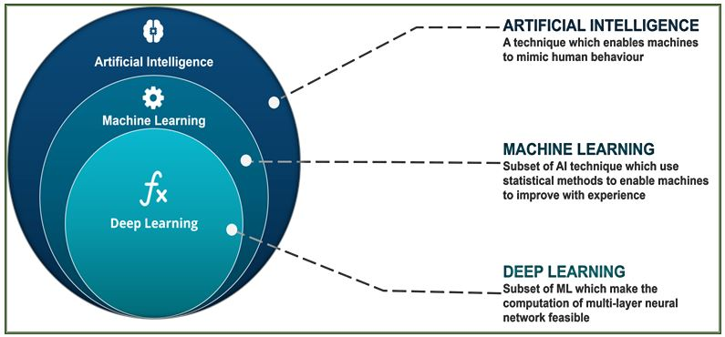
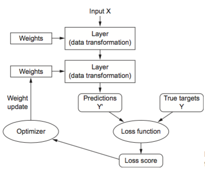

```{r,echo=F}
library(knitr)
```

L'essentiel de cette partie est issue de l'ouvrage *Deep Learning with
R*, réalisée par @chollet_deep_2018.

## Qu'est-ce que c'est que le deep learning ?

Pour cela, il est nécessaire de restituer l'intelligence artificielle (ou *AI* pour Artifical Intelligence), le machine learning et le deep learning, comme présenté dans la figure \ref{AI}, et de bien comprendre à quoi renvoie chacun de ces trois domaines.

```{r,fig.cap="\\label{AI} Place du deep learning dans l'intelligence artificielle", fig.pos="H",echo=F}
library(png)
library(grid)

```

Une définition de l'IA proposé par Chollet et Allaire est : *L'effort d'automatiser des tâches intellectuelles habituellement réalisé par l'homme*. Elle regroupe de nombreux domaines, dont le machine learning et le deep learning, mais pas uniquement. Elle groupe également des domaines n'incluant aucun domaine d'apprentissage, comme les premiers programmes de jeux aux échecs, en ne programmant que les règles du jeu.  On parle de *symbolic IA* dans ce cas.  L'IA permet notamment de résoudre des problèmes avec un ensemble de règle bien défini, mais montre des limites quand des règles précises ne sont pas établies.

Dans de tels cas, on passe alors au machine learning. L'objectif est alors à partir de données et de réponses, de faire émerger des règles de la part de l'IA. Cela nécessite un "*entraînement*" pour faire émerger des règles, et donc une grande quantité de données. Un algorithme de machine learning a donc besoin de trois éléments : des données d'entrée, des exemples de sorties attendues et un métrique pour vérifier que l'algorithme réalise bien son travail. C'est en comparant les entrées et les sorties qu'il "*apprend*" donc. On passe alors de règles et de données en entrées à des données et des réponses. Cela passe notamment par donner de meilleures représentations pour donner les sorties attendues, afin de faire émerger les règles. L'ACP est donc considéré par certains comme du machine learning. On tend à rapprocher le machine learning des statistiques, mais le ML tend à travailler avec de bien plus grand jeux de données et bien plus complexes.  Il y a au final peu de théorie mathématique à la base du ML. De ce fait, les idées sont en générales plus empiriques que théoriques. 

Pour réaliser du ML, il faut trois éléments :

- Des données d'entrées

- Des examples de sorties attendues

- Un moyen de mesurer la qualité du travail de l'algorithme. 


### Grands principes du deep learning

Le deep learning est une sous-catégorie particulière du machine learning. Le terme *deep* y renvoie à une succession de différence couche (layer en anglais) d'apprentissage, et donc différente couche de représentation. Chacune de ces couches sont représentées par des réseaux de neurones, empilés les uns sur les autres (d'où la notion de couche). Même si la notion de réseaux de neurones renvoie à des concepts de neuro-biologie, car certains concepts du deep learning sont tirés de notre connaissance du cerveau, les modèles de deep learning ne sont pas des modèles du cerveau (comme l'affirment certains articles de presse grand public).

Le deep learning a de nombreuses applications au quotidien. En voici quelques exemples : reconnaissance de caractères (via la lecture automatique de code postaux), amélioration des outils de traduction, assistant digitaux vocaux comme ceux proposés par Google et Amazon, intelligence de jeux pour le GO ou Starcraft 2.


Prenons le cas d'input X comme présenté sur la figure \ref{DP_function}. Une première couche de neurone enregistre des poids, c'est-à-dire des nombres. Dans ce cas, l'apprentissage correspond à trouver l'ensemble des valeurs des poids de toutes les couches du réseau de neurones (On dit que la transformation est paramétré par ses poid, *parametrized* en anglais). Cependant, un réseau neuronal profond (deep neural network) peut contenir des millions de paramètres. Il devient donc particulièrement difficile de trouver l'ensemble des valeurs fonctionnant ensemble. Pour contrôler cela, il faut utiliser la *loss function* qui mesure la distance entre les sorties obtenues (i.e. prédites) et attendues (aussi appelé *objective function*). Grâce à cela, elle donne comment s'est comporté le réseau de neurones sur l'apprentissage. Un élément important est d'utiliser cette *loss function* comme un signal de retour pour ajuster les valeurs de poids, afin de baisser le *loss score* (i.e. la distance donnée). Ceci est réalisé par l'*optimizer*, qui implémente l'algorithme de *backpropagation*, qui est l'algorithme central du deep learning.

Initialement, les poids des réseaux de neurones sont attribués aléatoirement, et cela peut nécessiter plusieurs retours en arrière
pour ajuster ces valeurs. C'est la boucle d'apprentissage (*training loop*), qui répétait suffisamment de fois, permet de minimiser la fonction de perte (*loss function*).

```{r,echo=F,fig.cap="\\label{DP_function} Fonctionnement de base du deep learning",fig.pos="H"}

```


## Bases mathématiques des réseaux de neurone.

Travail via un exemple sur la catégorisation d'images contenant chacune un chiffre. L'objectif est de *labelliser* chaque image (ou *échantillon*) à une *classe*. Comme pour du ML, on sépare le jeu de données, avec des données d'*entraînement* et de *validation*. Pour chacun des jeux de données, il y a à chaque fois les données d'entrées et de sorties associées. Dans le premier cas pour entraîner le modèle, dans le second pour le valider. 


```{r}
library(keras)
library(reticulate)
reticulate::install_miniconda()
conda_create("r-reticulate")
use_condaenv("r-reticulate")
conda_install("r-reticulate",c('keras','tensorflow'))
```

C:\\Users\\PIGA11025381\\AppData\\Local\\r-miniconda\\envs\\r-reticulate\\python.exe

```{r}
# Au premier chargement, vérifie l'existance des éléments pythons nécessaires
# Il faut notamment miniconda pour le faire tourner
library(keras)
# a éexecuter pour l'installation (assez long)
# reticulate::install_miniconda()
# keras::install_keras()
library(tensorflow)
install_tensorflow()
mnist<-dataset_mnist()
```


Error: Tensorflow installation failed (no conda binary found)

Install Miniconda by running `reticulate::install_miniconda()` or install Anaconda for Python 3.x (https://www.anaconda.com/download/#windows) before installing Tensorflow.

